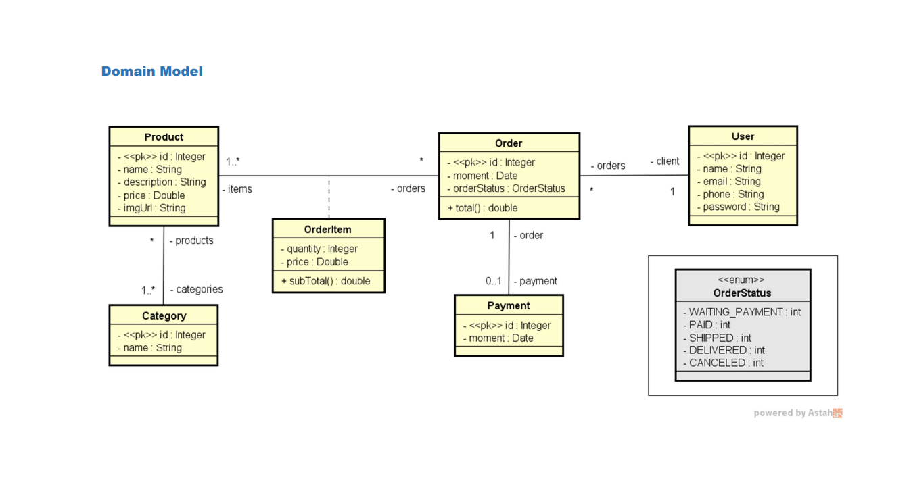
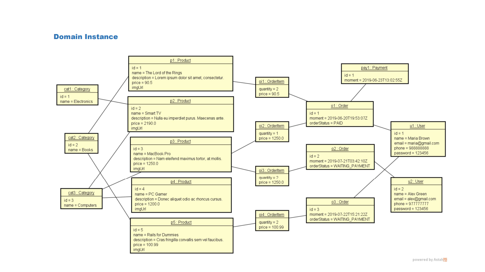

# Projeto Web Services com Spring Boot e JPA / Hibernate

[](https://github.com/seu-usuario/seu-repositorio/blob/main/LICENSE)

# Sobre o Projeto

O Projeto Web Services com Spring Boot e JPA / Hibernate é uma aplicação desenvolvida como parte do curso [DevSuperior](https://devsuperior.com "Site da DevSuperior"). Tem como objetivo demonstrar a implementação de um conjunto de funcionalidades utilizando Spring Boot, JPA / Hibernate e Maven. Este projeto inclui operações CRUD (Create, Retrieve, Update, Delete) para entidades como Usuário, Order, OrderItem, Payment, Product e Category. Além disso, possui tratamento de exceções para lidar com possíveis erros durante as chamadas de API.

## Funcionalidades

- Criar projeto Spring Boot Java
- Implementar modelo de domínio
- Estruturar camadas lógicas: resource, service, repository
- Configurar banco de dados de teste (H2)
- Povoar o banco de dados
- CRUD - Create, Retrieve, Update, Delete
- Tratamento de exceções

## Modelos de Banco de Dados

### Modelo de Domínio

O modelo de domínio deste projeto é organizado da seguinte maneira:

- Um Usuário pode possuir diversos Pedidos, sendo que cada Pedido está associado a apenas um Usuário.
- Um Pedido possui um ou vários OrderItem(s), que representam os itens do pedido.
- Cada OrderItem está associado a um ou mais Produtos, os quais podem pertencer a uma ou mais Categorias.
- Um Pedido possui um status, definido por um enum `OrderStatus`, que indica o estado atual do pedido, como enviado, pago, aguardando pagamento, etc.
- Além disso, um Pedido também possui um pagamento associado, que inclui apenas o ID e o momento da transação.



### Instância de Domínio

Para uma melhor compreensão, veja uma instância de exemplo do modelo de domínio:



# Tecnologias Utilizadas

- Java
- Spring Boot
- JPA / Hibernate
- Maven
- H2 Database

# Como Executar o Projeto

## Pré-requisitos

- Java
- Maven

## Executando o Projeto

```bash
# clonar repositório
git clone https://github.com/seu-usuario/seu-repositorio

# entrar na pasta do projeto
cd seu-repositorio

# executar o projeto
mvn spring-boot:run
